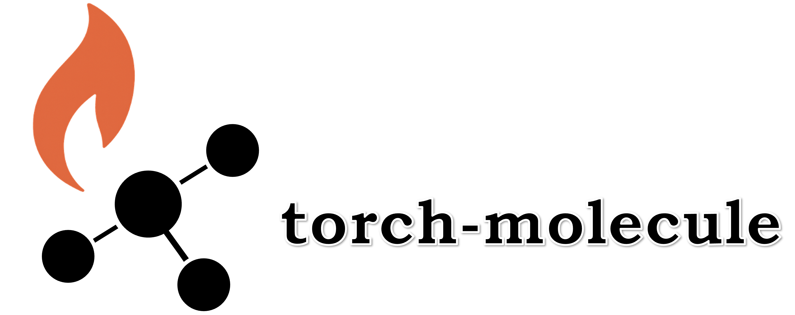

torch-molecule documentation
============================

Welcome to the torch-molecule. torch-molecule is an actively developed package designed to facilitate molecular discovery through deep learning. 

It offers a user-friendly interface similar to `sklearn`, and includes model checkpoints for efficient deployment and benchmarking across various molecular tasks. The package currently focuses on three main components:

- Predictors: Molecular property prediction models that make predictions (regression or classification) based on molecular graphs.
- Generators: Molecular graph generators that generate new molecules.
- Encoders: Molecular graph encoders that convert molecular graphs into a vector representation.

.. toctree::
   :maxdepth: 1
   :caption: Getting Started:
   :hidden:

   install
   example
   overview

.. toctree::
   :maxdepth: 2
   :caption: Main Components:
   :hidden:

   api/predictor
   api/generator
   api/encoder

.. toctree::
   :maxdepth: 1
   :caption: API for utilities:
   :hidden:

   api/nn
   api/base
   api/utils

.. toctree::
   :maxdepth: 1
   :caption: Additional Information:
   :hidden:

   additional
